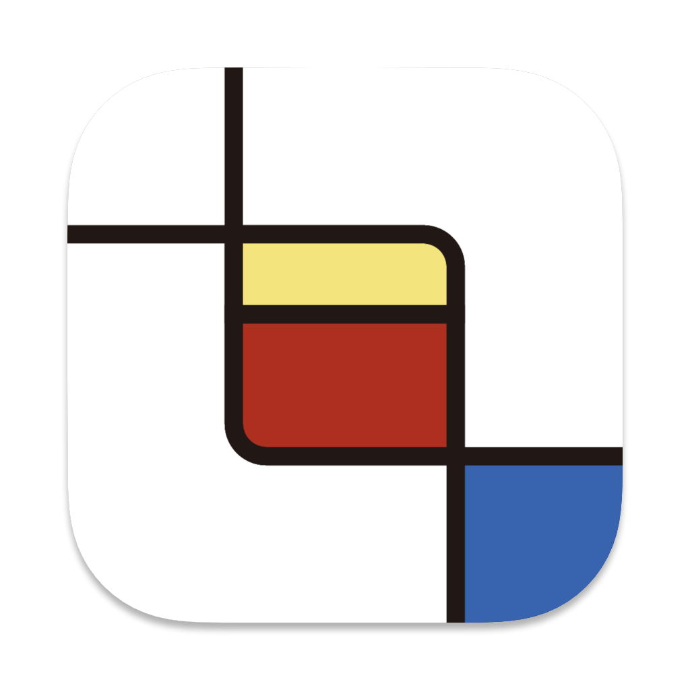
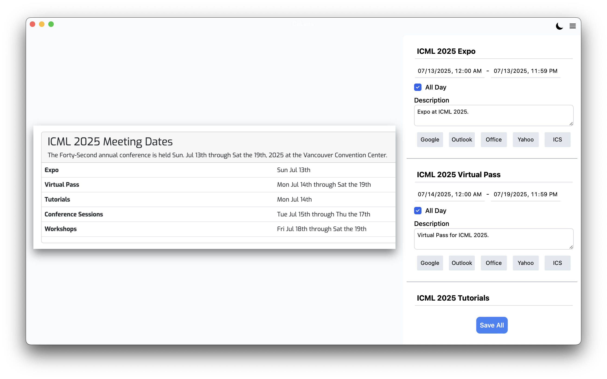
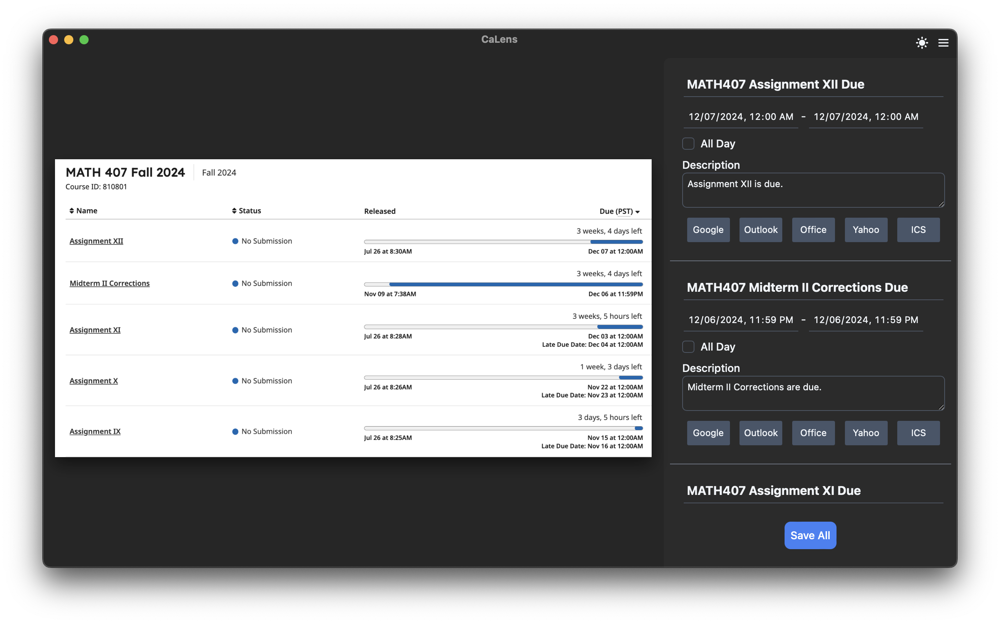

<div align="center">
 
 
 <h1>CaLens</h1>

:x: No more manual event or deadline entries!

Simply take a screenshot with CeLens, and it will automatically add the event to your calendar :rocket:

Powered by :eyes: Vision Language Models

[](https://github.com/Cy-47/CaLens/releases/)

Join the [discord server](https://discord.gg/VUW9EX8k) for release, updates, support, and more!

[](https://discord.gg/VUW9EX8k)

</div>



## :rocket: Features

- :crystal_ball: Intelligent extraction & summary by Vision LLM
- :scissors: Take screenshot anywhere global shortcut
- :link: Show links to mainstream calendars
- :zap: Add multiple events in one time
- :moon: Dark mode

### :dart: Planned

- $\int$ Google calendar API integration
- :floppy_disk: Download ICS
- :cloud: Officially hosted server



## :computer: Supported OS

- [x] MacOS
- [ ] Windows: :eyes: coming soon
- [ ] Web: :eyes: coming soon
- [ ] Linux: :penguin: contribution welcomed
- [ ] Mobile: :full_moon_with_face: possible future

## :cake: Usage

Before the release of the officially hosted version, you will need to provide your own [OpenAI API key](https://openai.com/index/openai-api/), which will be stored locally in the app's config directory. Note: [tier 1](https://platform.openai.com/docs/guides/rate-limits#usage-tiers) is required to access gpt-4o.

After that, just press the shortcut to take screenshots!

> [!WARNING]
> Currently, the API key is stored as plain text in a config.json file.
> This is fine for usage on a private computer, but may cause the key to be leaked if others have access to the file.

## :hammer: Build

To build CeLens from source, follow these steps:

1. Install [pnpm](https://pnpm.io/installation) (or [npm](https://docs.npmjs.com/downloading-and-installing-node-js-and-npm)) and [rust](https://www.rust-lang.org/tools/install)
2. Clone the repository:
   ```sh
   git clone https://github.com/Cy-47/CaLens.git
   ```
3. Install dependencies
   ```sh
   cd CaLens/Core
   pnpm install
   cd ../Desktop
   pnpm install
   ```
4. Build and run the application

   Use one of the following commands:

   ```sh
   # For development
   pnpm tauri dev
   # For production build
   pnpm tauri build
   ```

## :art: Contribution

Welcome!

### :book: Language, Frameworks & Tools

- TypeScript
- Tauri
- SvelteKit & Vite
- TailwindCSS
- OpenAI API
- Flowbite Svelte

### :open_file_folder: Repo structure

- `Core`
  - Event parsing, inference
- `Desktop`
  - Desktop App
