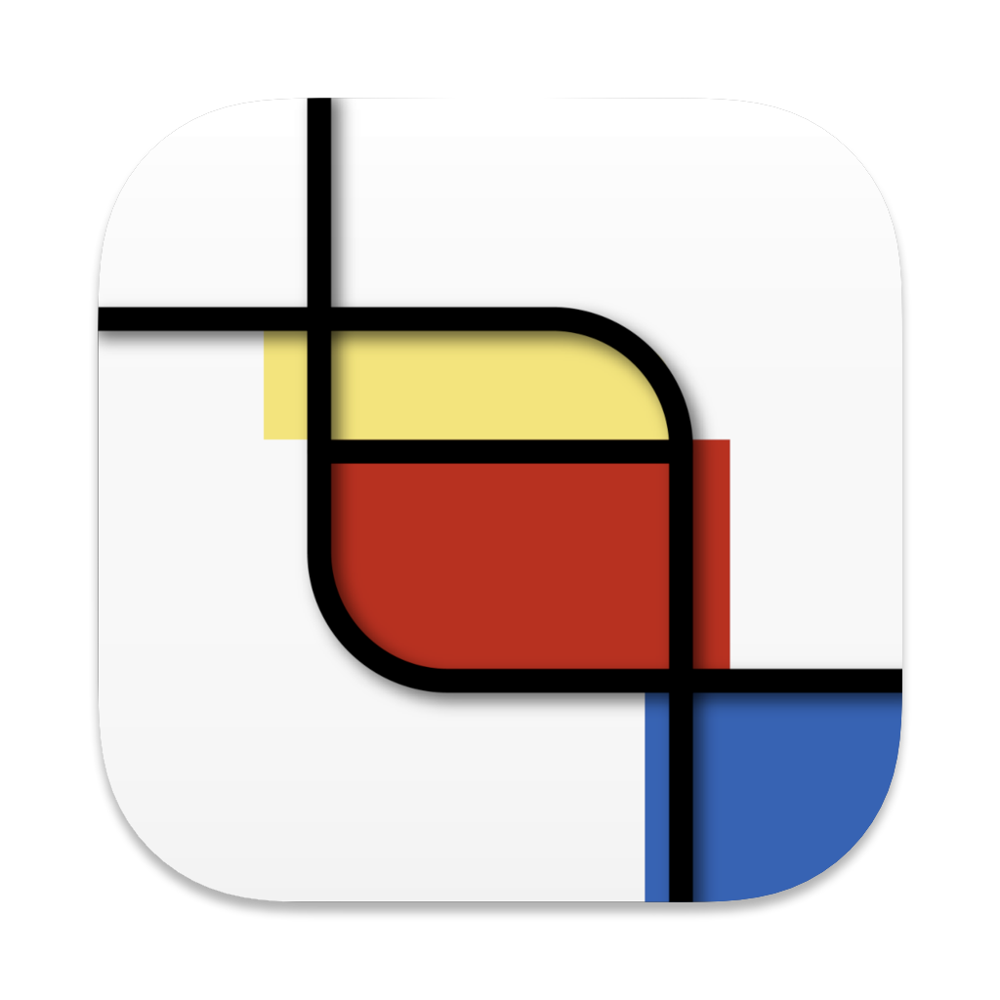

<div align="center">
 
 <h1>CaLens</h1>
</div>

No more manual event or deadline entries!

Simply take a screenshot with CeLens, and it will automatically add the event to your calendar.


_*Screenshot is taken in Pacific Time_

## :paperclip: Contents

- [:paperclip: Contents](#paperclip-contents)
- [:rocket: Functions](#rocket-functions)
- [:calendar: Usage](#calendar-usage)
- [:hammer: Build](#hammer-build)

## :rocket: Functions

- [x] Event extraction
- [x] Show links to mainstream calendars
- [ ] Add multiple events in one time
- [ ] Google calendar API integration
- [ ] Download ICS
- [ ] Officially hosted server

## :calendar: Usage

The app is currently in early development. You need to provide your own OpenAI API key, which will be stored locally in the app's config directory.

## :hammer: Build

To build CeLens from source, follow these steps:

1. Clone the repository:
   ```sh
   git clone https://github.com/Cy-47/CaLens.git
   ```
2. Navigate to the project directory:
   ```sh
   cd CeLens/Desktop
   ```
3. Install the dependencies:
   ```sh
   pnpm install
   ```
4. Build and run the application:

   Use one of the following commands:

   ```sh
   # For development
   pnpm tauri dev
   # For production build
   pnpm tauri build
   ```
